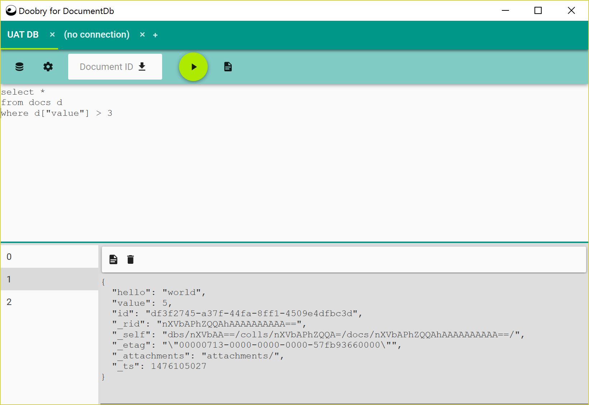
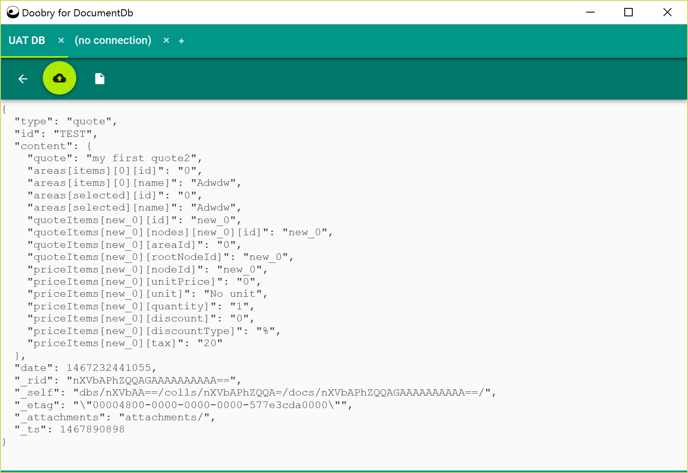
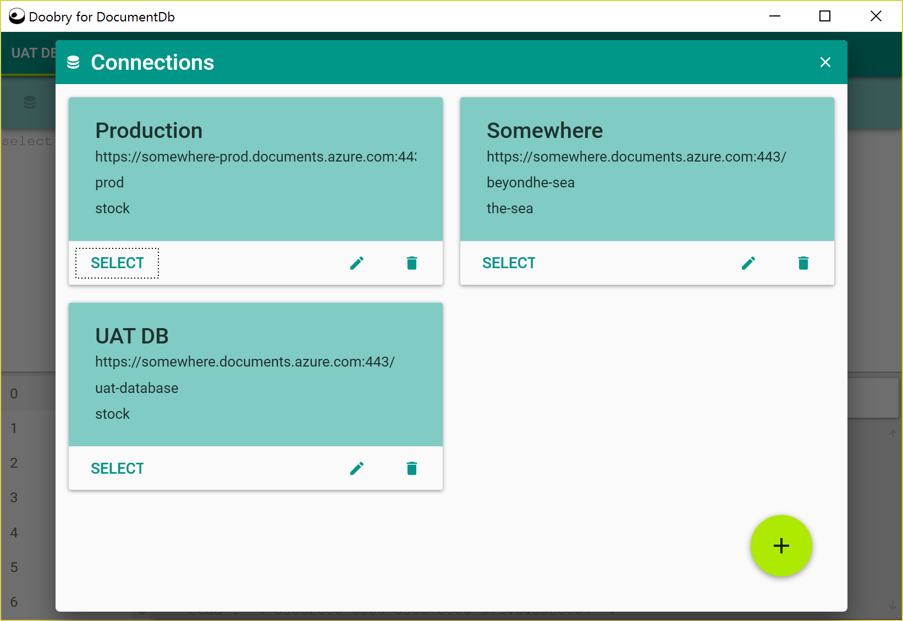
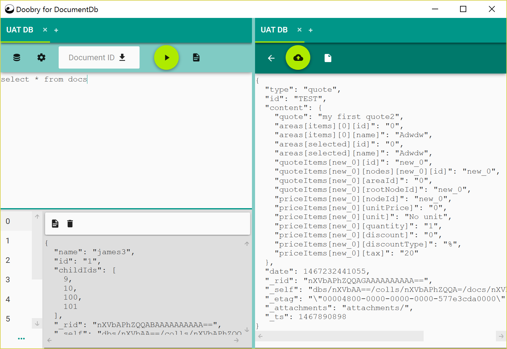

# doobry for Azure DocumentDB

doobry is a slick Windows based query development for Azure DocumentDb

* Develop, run, edit your DocumentDb SQL commands
* Add, edit and delete documents
* Work with multiple database

# Install

If you want to install the application please visit http://materialdesigninxaml.net/doobry

# Code base

This is a C# and WPF application, requiring VS2015+

