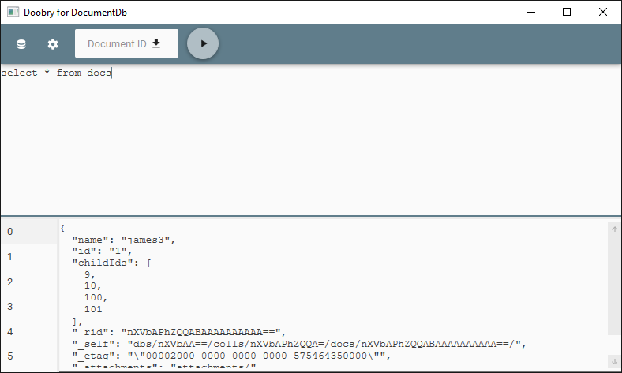

# doobry for Azure DocumentDB

Simple query runner for working with Azure's DocumentDB.

Please note this is in an early stage of development:

* No binaries; clone and launch view Visual Studio
* Only the most trivial PRs until the code is fleshed out some more

## Initial features to come:

* Multiple connection
* Connection/settings persistance
* Add and delete documents

